# Advanced Clipboarder

A fast, keyboard-first clipboard manager for Windows. everything local.

<p align="center">
  
</p>

<p align="center">
  
  
  
</p>

---

## What it does

Every time you copy something, Advanced Clipboarder snapshots it — text, code, links, images, colors, files — then lets you search, pin, and paste anything back with a global hotkey. Nothing leaves your machine.

## Features

- **Universal capture** — text, rich text, images (PNG/JPG), file drops, colors (HEX), URLs, code snippets
- **Smart typing** — auto-detects kind of content (email, link, 2FA code, code snippet per language)
- **Global hotkey** — `Ctrl+Shift+V` pops the window over any app
- **Instant search** — press `/` to focus, queries match type, source, and content
- **Categories** — All · Pinned · Text · Code · Links · Images · Colors · Files
- **Pin what matters** — pinned items stay on top forever across sessions
- **Paste-at-caret** — `Enter` pastes directly into the app you came from
- **Grouped timeline** — Last hour / Today / Yesterday / Earlier
- **Live refresh** — new clips land with a subtle green flash
- **Encrypted history** — on-disk store is sealed with Windows DPAPI (per-user); other local users can't read it
- **Password-manager aware** — clips from KeePass, 1Password, Bitwarden, LastPass, Dashlane, Enpass, RoboForm, NordPass, Keeper, ProtonPass, Psono are skipped at the source
- **Auto-update** — checks GitHub for a newer release on startup and offers a silent, one-click install
- **Persistent history** — debounced writes, survives restarts
- **Single-instance + tray** — second launch just re-opens the window
- **Keyboard everything** — `Esc` to hide, `Ctrl+P` to pin, `Ctrl+F` to focus search
- **Native WPF, no Electron** — ~40 MB install, instant cold start

## Keyboard shortcuts

| Shortcut         | Action                          |
| ---------------- | ------------------------------- |
| `Ctrl+Shift+V`   | Show / hide the window (global) |
| `/`              | Focus search                    |
| `Esc`            | Hide window / clear search      |
| `Enter`          | Paste selected item             |
| `Ctrl+P`         | Pin / unpin selected            |
| `Ctrl+F`         | Focus search                    |

## Preview

The animated SVG above loops through the same demo as [`preview.html`](preview.html): new clip arrives → hover → copy → toast. Open the HTML file locally for a higher-fidelity version that uses the bundled Outfit font.

## Build & run

Requirements: **.NET 8 SDK**, **Windows 10 (1809+) or Windows 11**.

```bash
git clone https://github.com/enoughdrama/advanced-clipboarder.git
cd advanced-clipboarder
dotnet build -c Release
dotnet run -c Release
```

Or open `Clipboarder.sln` in Visual Studio 2022 / Rider and press F5.

### Publish a single-file exe

```bash
dotnet publish -c Release -r win-x64 --self-contained false -p:PublishSingleFile=true
```

Output lands in `bin/Release/net8.0-windows/win-x64/publish/`.

## Architecture

```
Models/          — ClipItem, ClipCategory, SeedData (typed clipboard records)
Services/        — ClipboardMonitor, HotkeyService, HistoryStore,
                   PasteService, TrayService, CodeDetector, SingleInstance
ViewModels/      — MainViewModel (INotifyPropertyChanged, ICollectionView)
Styles/          — Theme.xaml (palette), Controls.xaml, Icons.xaml
Templates/       — CardTemplates.xaml + CardTemplateSelector (per-type cards)
Converters/      — HexToBrush, BoolToVisibility, ImageCaption, …
MainWindow.xaml  — layout, drag-drop, hotkeys, toast host
```

Data flow:

1. `ClipboardMonitor` listens to Windows clipboard change events (`AddClipboardFormatListener`).
2. On each change, a `ClipItem` is built — type is inferred, language is sniffed with `CodeDetector`.
3. `MainViewModel.AddIncoming` dedupes against the last item and prepends to an `ObservableCollection`.
4. `ICollectionView` filters by category + search and groups by time bucket.
5. Before step 2 runs, `CaptureRules` checks the clipboard's exclusion formats (`ExcludeClipboardContentFromMonitorProcessing`, `CanIncludeInClipboardHistory`, `CanUploadToCloudClipboard`, `Clipboard Viewer Ignore`) and the foreground process name against the blocklist — password-manager clips never enter memory.
6. `HistoryStore` serialises the list to UTF-8 JSON, seals it with DPAPI (`CurrentUser` scope + domain-separation salt), and writes `%APPDATA%/Clipboarder/history.dat` atomically.

## Privacy

- **Encryption at rest.** `history.dat` is a DPAPI blob tied to your Windows account; another user on the same machine cannot read it. On first launch after upgrading from a pre-0.1.1 build, the legacy `history.json` is migrated and deleted.
- **Capture rules.** The following process name prefixes are blocked by default (case-insensitive, matched with `StartsWith` on `Process.ProcessName`):

  `KeePass`, `1Password`, `Bitwarden`, `LastPass`, `Dashlane`, `RoboForm`, `Enpass`, `NordPass`, `Keeper`, `Protonpass`, `Psono`

  To customise, edit `%APPDATA%\Clipboarder\settings.json`:

  ```json
  {
    "BlockedProcesses": ["KeePass", "1Password", "MyCorpSecretsApp"]
  }
  ```

  Omit the key (or set it to `null`) to use the defaults; set it to `[]` to disable the blocklist entirely (exclusion-format checks still apply).

## Roadmap

- [ ] Clipboard sync across machines (optional, encrypted)
- [ ] Snippet library with template variables
- [ ] Global search palette (Spotlight-style)
- [ ] Import/export history

## License

MIT — see [LICENSE](LICENSE).
